# **Graduação IA e Automação Digital - 1º Semestre**
## *Trabalho para a disciplina de Banco de Dados Visual e Ferramentas Integradas*

### Introdução:
Construção de uma Solução No-Code para Gestão de Eventos e Beneficiários de uma ONG

Projeto executado no Airtable para demonstrar a modelagem de banco de dados visual e automações integradas.

# Vídeo de demonstração (clique na imagem para assistir no youtube):

### 🛠️ Tecnologias e Ferramentas

O projeto utilizou a ferramenta **Airtable** (No-Code) e os seguintes padrões e integrações:

| Categoria               | Recurso Principal                                |
| :---------------------- | :----------------------------------------------- |
| **Dados Visual**        | Airtable Base - arquitetura da base de dados     |
| **Automations**         | Airtable Automations - automações integradas     |
| **Interfaces**          | Airtable Interfaces - telas de sistema           |
| **Forms**               | Airtable Forms - formulários de entrada          |
| **Integração de Dados** | Google Sheets - integração de dados              |

### Requisitos
- Não há requisitos específicos além de um navegador web moderno.

## Como usar a área logada da ONG

Para usar a interface criada no Airtable você deverá fazer login com um email *@a.fecaf.com.br* no link abaixo:
[Link para se tornar colaborador (editor)](https://airtable.com/invite/l?inviteId=invGtfpvZNz2hwpXI&inviteToken=a0b297ca77b4fa87c8a76a96f37409ade459aa72c5ffbbab84b24034cf9b0a4b&utm_medium=email&utm_source=product_team&utm_content=transactional-alerts)

Após aceitar o convite, acesse a base de dados no link:
[Link da Interface para Colaboradores da ONG](https://airtable.com/appYPltRo0QQiAMT0/pagiisukZcaFF0ph8)

# Como me cadastrar como beneficiário (acesso público)

Para se cadastrar como beneficiário e participar dos eventos da ONG, acesse o formulário público no link abaixo:
[Formulário Público para cadastro Beneficiários](https://airtable.com/appYPltRo0QQiAMT0/pagQf669kwlTMiqNf/form)

# Como me inscrever em eventos (acesso público)

Para se inscrever em eventos como beneficiário, acesse o formulário público no link abaixo:
[Formulário Público para inscrição em eventos](https://airtable.com/appYPltRo0QQiAMT0/pagJwbgBRLWYwK5cc/form)

## Documentação Técnica

### Diagrama Entidade-Relacionamento (ER)
A modelagem conceitual foi elaborada com a ferramenta BR Modelo Web, utilizando o diagrama Entidade-Relacionamento (ER). O modelo foi projetado para representar de forma clara as entidades, seus atributos e relacionamentos, priorizando simplicidade e aderência ao contexto No-Code.
O diagrama ER está disponível publicamente em:
[https://app.brmodeloweb.com/\#\!/publicview/695f0201318718d742587c40](https://app.brmodeloweb.com/#!/publicview/695f0201318718d742587c40)

`O diagrama não representa as tabelas no Airtable de forma literal, mas sim os principais elementos e relacionamentos. Algumas adaptações foram feitas para atender às limitações e recursos da ferramenta No-Code utilizada.`

### Planilha auxiliar para consulta de integrações
Para simular integrações externas, como envio de mensagens no whatsapp, foi utilizada uma planilha no Google Sheets apenas para fins de consulta e validação, sem uso produtivo para não gerar custos com envio de mensagens via whatsapp.
[Link da planilha: Integração Whatsapp](https://docs.google.com/spreadsheets/d/1pnh1yvBrvObXx9qH_IbfIemXwBBd39zL5vS7oem0BIw/edit?usp=sharing)

### Estrutura de dados
A solução foi implementada com **quatro tabelas principais**, conforme descrito a seguir.

#### 1.Tabela: *Eventos*

Responsável por armazenar todas as informações relacionadas aos eventos promovidos pela ONG.

Principais atributos:
- **Event ID (PK)**  
- Name  
- URL to Register (campo calculado)  
- Cancelled Event  
- Start Date / End Date  
- Publish Date (campo calculado)  
- Status (campo calculado)  
- Category  
- Indicadores de notificações  
- Registrations (FK)  
- Registrations Count (campo calculado)  
- Campos de auditoria (Created By, Created At, Updated At)

---

#### 2.Tabela: *Peoples*

Armazena os dados dos beneficiários e colaboradores cadastrados na base.

Principais atributos:
- **Email (PK)**  
- Name  
- Birthdate  
- Age (campo calculado)  
- Preferências de notificação  
- Dados de contato e endereço  
- Is Valid CEP (campo calculado)  
- Registrations (FK)  
- Campos de auditoria

---

#### 3.Tabela: *Registrations*

Tabela associativa responsável por representar o relacionamento entre beneficiários e eventos.

Principais atributos:
- **Registration ID (PK)**  
- Peoples (FK)  
- Events (FK)  
- Indicadores de leitura e confirmação  
- Preferências de notificação  
- Campos de auditoria

Essa tabela permite que um beneficiário se inscreva em múltiplos eventos, mantendo o histórico de participação.

---

#### 4.Tabela: *Notifications Log*

Utilizada para registrar o histórico das notificações enviadas pelo sistema.

Principais atributos:
- **Notification ID (PK)**  
- Notification Time  
- Notification Type  
- Notification Format  
- Notification To  
- Read Time  

Por questões de segurança e privacidade, o conteúdo das mensagens não é armazenado nos logs para colaboradores.

### Prints da Aplicação

#### Data: [assets/data/](./assets/data/)
#### Automations: [assets/automations/](./assets/automations/)
#### Forms: [assets/forms/](./assets/forms/)

#### Interface para Colaboradores (Área Logada): [assets/interfaces/](./assets/interfaces/)
##### Dashboard
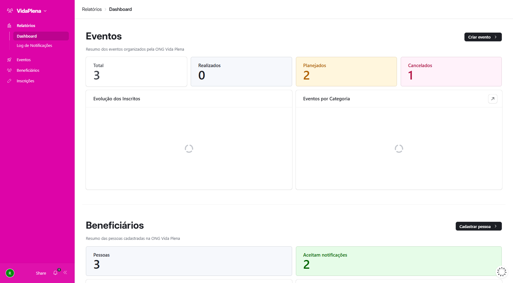
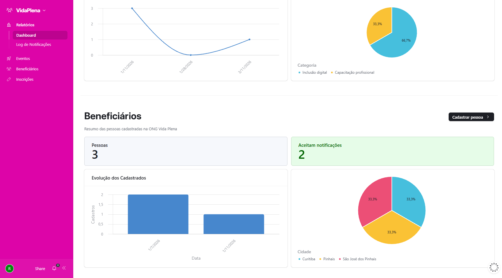

##### Log de Notificações
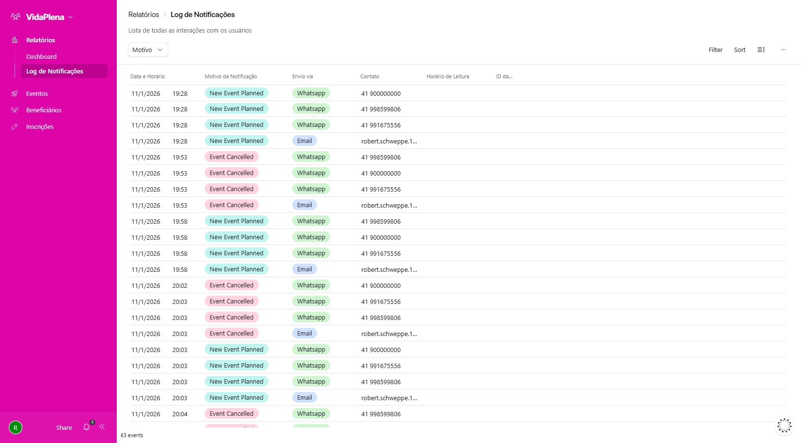

##### Ver Eventos
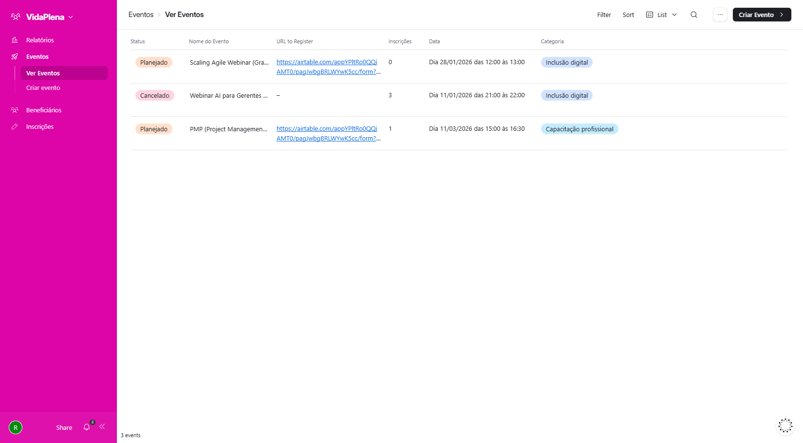

##### Ver Eventos - Detalhes do Evento
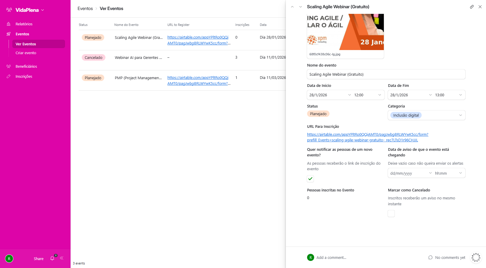

##### Ver Eventos - Visão Calendário
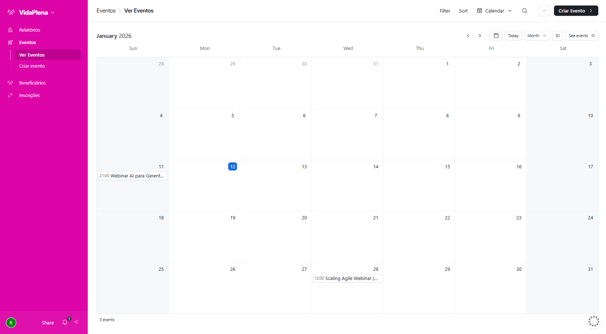

##### Ver Eventos - Visão Galeria
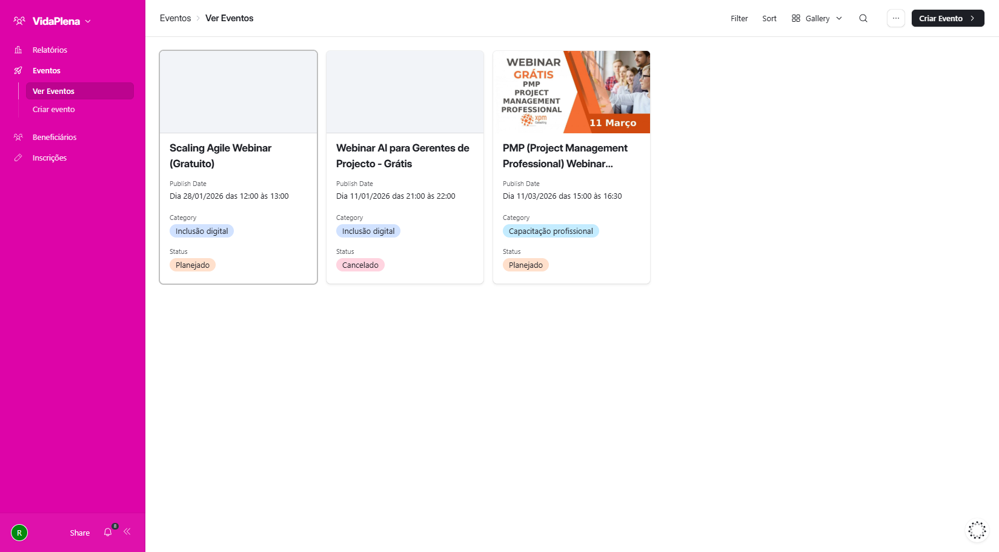

##### Ver Eventos - Visão Kanban
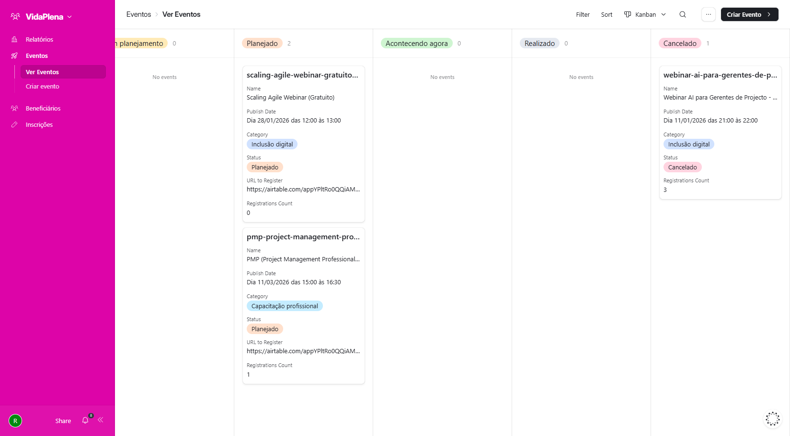

##### Criar Evento
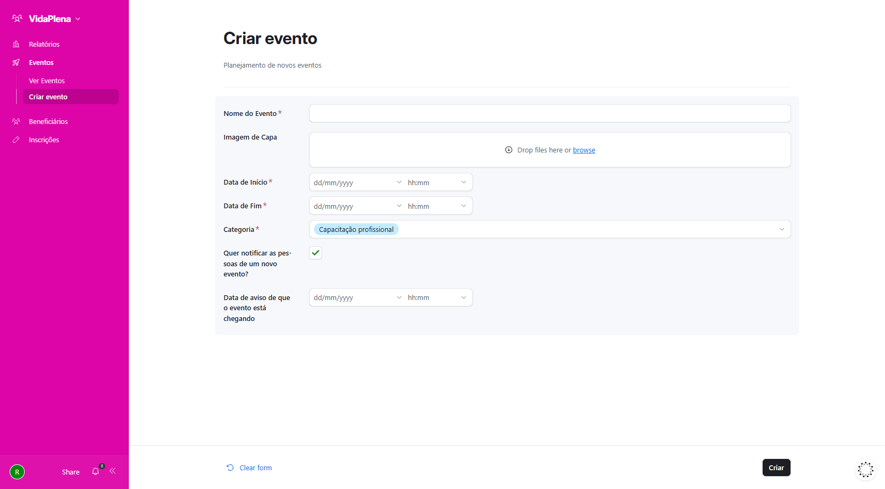

##### Ver Pessoas
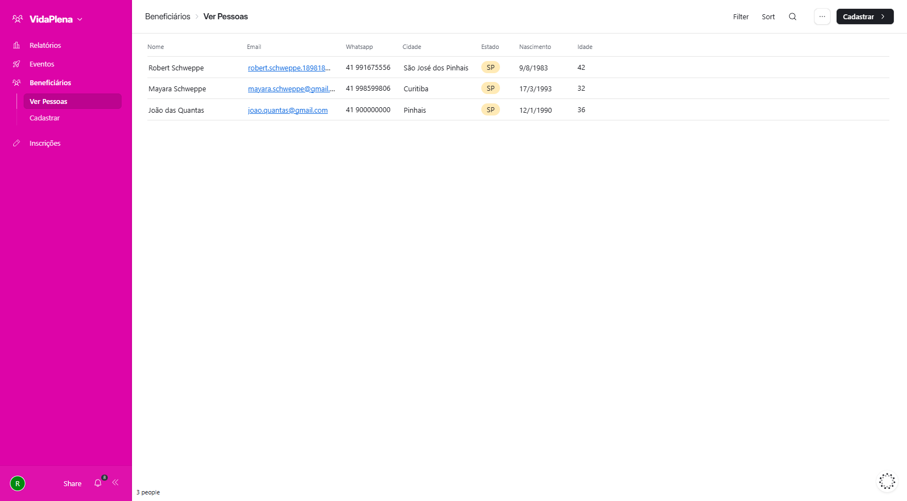

##### Ver Pessoas - Detalhes do Beneficiário
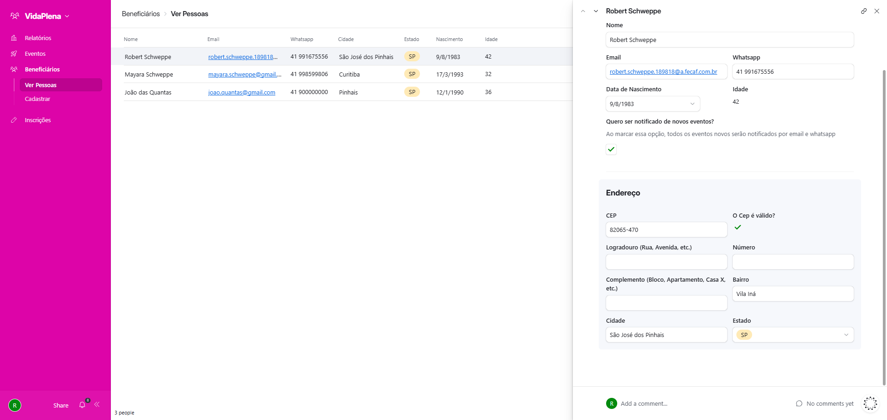

##### Cadastrar
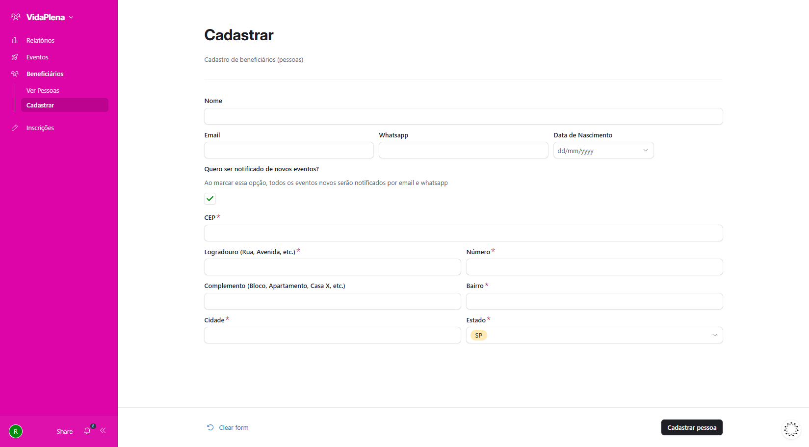

##### Ver Inscrições
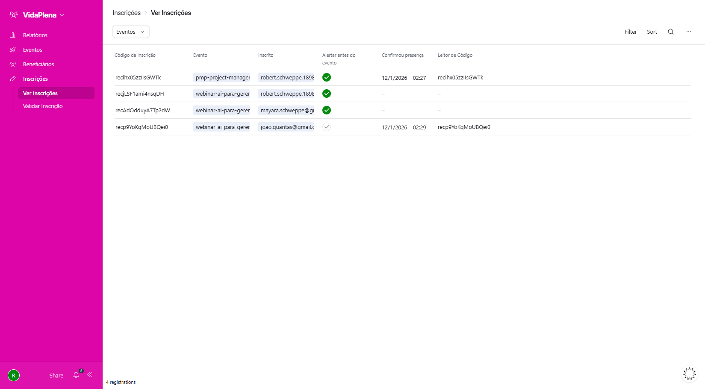

##### Ver Inscrições - Detalhes da Inscrição
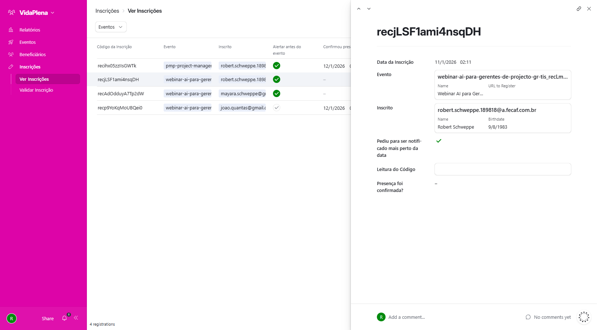

##### Validar Inscrição - Detalhes Pendente
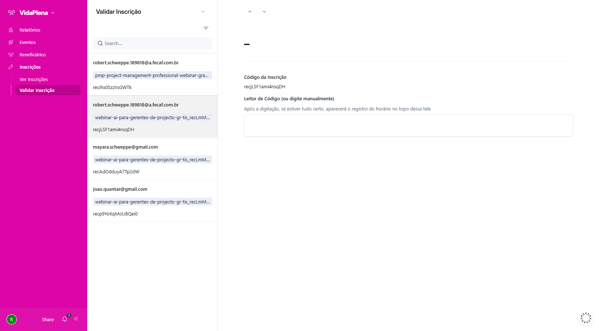

##### Validar Inscrição - Detalhes Válido
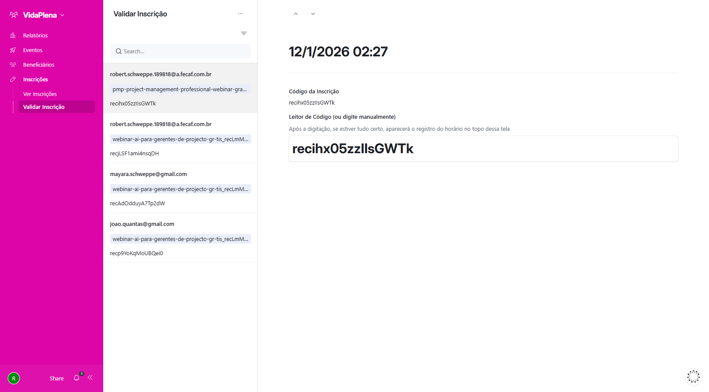